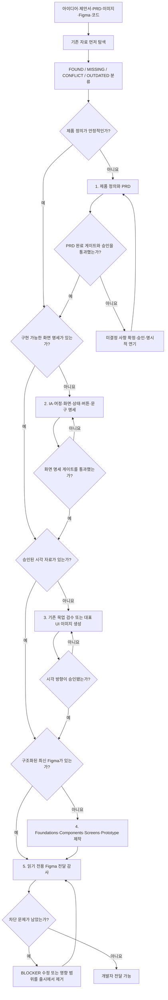

# 걸어서 Figma(디자인) 속으로

한국어 · [English](README.md)

> **마법 말고 명세.**

러프한 아이디어, 제안서, PRD, 스크린샷 또는 기존 Figma 파일에서 시작해 검증된 제품 명세, 함께 검수할 UI 목업, 구조화된 Figma 프로토타입, 개발자 전달 자료까지 완성합니다.

**한 번 호출하고, 어디서든 시작하세요.** 이미 가진 자료를 먼저 찾아보고 필요한 단계만 실행합니다.

마법의 스킬이 아닙니다. 그래서 반복해서 사용할 수 있습니다. 여러분과 AI가 제품의 모호함을 단계적으로 제거하고, 결과물을 직접 확인하고, 승인을 기록해 개발자가 추측하지 않아도 되는 상태를 만듭니다.

## 무엇을 해결하나요?

제품 개발은 문서 사이에서 자주 끊어집니다.

- PRD는 길지만 중요한 가정이 승인되지 않았습니다.
- 화면 명세에는 페이지 이름만 있고 버튼 동작이 없습니다.
- 예쁜 목업에는 로딩·오류·잠금·복구 상태가 빠져 있습니다.
- 최신 결정과 Figma가 서로 다릅니다.
- 개발자는 구현 계약이 아닌 보기 좋은 화면만 전달받습니다.

이 스킬은 제품 정의, 화면 명세, 시각 검수, Figma 제작, 개발 전달 QA를 추적 가능한 하나의 여정으로 연결합니다.

## 빠른 시작

전체 스킬을 설치합니다.

```bash
git clone https://github.com/Dr-Min/walk-into-figma.git
cd walk-into-figma
./scripts/install.sh
```

새 스킬이 바로 보이지 않으면 Codex를 다시 불러오거나 재시작합니다.

```text
$walk-into-figma를 사용해줘.
내가 이미 가진 자료부터 확인하고 현재 단계에서 시작해
검증된 제품 디자인과 개발 가능한 Figma 전달 자료까지 안내해줘.
```

자연어로도 시작할 수 있습니다.

```text
러프한 제품 제안서가 있어. PRD부터 Figma까지 같이 만들어보자.
```

메인 스킬은 관련 디지털 제품 UI/UX 요청에 자동 호출될 수 있습니다. 전체 파이프라인을 명시적으로 실행하려면 `$walk-into-figma`를 사용하세요.

전문 스킬 5개는 중복 자동 호출을 막기 위해 명시적으로 `$스킬명`을 사용했을 때 실행됩니다. 특정 단계만 필요하면 해당 전문 스킬을 직접 호출할 수 있습니다.

## 무엇이든 넣고 시작할 수 있습니다

| 현재 가진 것 | 가장 먼저 하는 일 |
|---|---|
| 한 문장의 아이디어 | 제품의 기반을 질문하고 PRD를 시작 |
| 러프한 제안서·메모 | 결정, 가정, 충돌, 근거 누락을 추출 |
| 기존 PRD | 무작정 다시 쓰지 않고 완성도를 감사 |
| 화면 목록·UI 문구 | 사용자 여정과 누락된 인터랙션을 복원 |
| 스크린샷·목업 | 화면·상태별로 분류하고 부족한 시안을 식별 |
| 기존 Figma | 구조, 버튼 연결, 문서 드리프트, 전달 준비도를 점검 |
| 프론트엔드 코드·디자인 시스템 | 기존 컴포넌트와 토큰을 우선 재사용 |
| 여러 자료의 혼합 | 자료별 권위와 최신성을 구분하고 충돌을 표시 |

모든 입력 자료는 `FOUND`, `MISSING`, `CONFLICT`, `OUTDATED`로 분류됩니다.

## 전체 흐름



## AI와 사용자가 협업하는 방식

기본값은 **단계 검수 모드**입니다. AI가 혼자 모든 PRD와 Figma를 한 번에 지어내지 않습니다.

각 챕터가 끝날 때 다음 내용을 보여줍니다.

```text
사용자가 확정한 내용
AI 권장안과 근거
결정 필요
기존 자료와 충돌
수정된 파일
이 챕터를 보완할까요, 승인하고 다음으로 넘어갈까요?
```

서로 관련된 질문은 묶어서 합니다. 쉽게 되돌릴 수 있는 일반적인 세부사항은 AI가 권장안을 적용하고 기록할 수 있습니다. 범위, 돈, 정책, 위험, 핵심 여정, 시각 방향, Figma 저장 위치를 바꾸는 결정은 반드시 승인을 받습니다.

단계 검수 모드에서는 한 번에 밀접하게 관련된 중요 결정만 최대 3개 질문합니다. 전체 차단 목록은 보여주되 이후 챕터의 결정은 대기 목록으로 남겨 거대한 설문처럼 한꺼번에 묻지 않습니다.

검토, 감사, 설명, 상태 확인 요청은 `REPORT ONLY`로 실행되며 파일을 만들거나 이름을 바꾸거나 정리·생성·수정하지 않습니다. 산출물과 Figma 쓰기는 해당 제작 요청과 승인된 범위가 있어야 합니다.

### 큰 단계가 끝났을 때

완료 조건을 실제로 통과한 뒤 다음 내용을 자연스럽게 안내합니다.

1. 전체 몇 단계 중 어떤 단계가 완료됐는지
2. 이제 어떤 여정을 시작하는지
3. 다음 단계를 하면 무엇이 좋아지는지
4. 생략하면 어떤 재작업이나 오해가 생길 수 있는지
5. 다음에 사용자가 무엇을 검수할지

초안만 존재한다는 이유로 완료됐다고 말하지 않습니다.

예시:

```text
좋습니다. 전체 5단계 중 1단계인 ‘제품 정의와 PRD’가 완료되었습니다.

이제 2단계인 ‘화면과 인터랙션 명세’를 완성하는 여정으로 넘어갑니다.
이 단계를 마치면 모든 화면과 버튼의 동작, 상태, 예외 처리가 명확해져
개발자와 디자이너가 서로 다르게 해석할 가능성이 크게 줄어듭니다.

이 단계를 생략하면 버튼의 목적지, 오류 처리, 모바일 동작처럼
구현에 필요한 결정이 뒤늦게 누락될 수 있습니다.
```

### 자율 진행 모드

원하면 다음처럼 요청할 수 있습니다.

```text
$walk-into-figma를 사용해줘.
중대한 결정만 질문하고 되돌릴 수 있는 작업은 끝까지 자율 진행해.
```

그래도 중요한 모호함, 권위 있는 자료의 충돌, 운영 계정·파일 위치, 되돌리기 어려운 외부 변경에서는 멈춥니다.

## 다섯 개 승인 게이트

| 게이트 | 통과 조건 |
|---|---|
| 제품 | 문제, 사용자, 가치, 규칙, 정책, MVP가 완성되고 승인됨 |
| 화면 명세 | 모든 MVP 화면, 버튼, 상태, 예외, 목적지가 연결됨 |
| 시각 | 대표 목업으로 시각 방향이 승인됨 |
| Figma 범위 | 계정, 팀, 파일, 플랫폼, 페이지, 프로토타입 범위가 확인됨 |
| 개발 전달 | 모든 BLOCKER가 수정되고, MAJOR는 수정되거나 담당자·근거와 함께 명시적으로 승인됨 |

## PRD의 100% 완료 판정은 엄격합니다

문서가 길다고 PRD가 끝난 것은 아닙니다.

PRD 스킬은 13개 영역을 가중 평가하고 차단 조건을 검사합니다. 각 적용 영역은 `가중치 × 점수 ÷ 2`로 계산하며, 승인된 `N/A` 영역은 분자와 분모에서 모두 제외합니다. 진행률은 진단용일 뿐이며, 다음 상태만 완료입니다.

```text
PRD STATUS: 100% COMPLETE — APPROVAL RECORDED
```

필요 조건:

- 적용되는 모든 필수 영역이 작성됨
- 중요한 결정이 사용자에게 확정되거나 현재 릴리스 밖으로 명시적으로 연기됨
- 해결되지 않은 충돌이 없음
- 요구사항과 인수 조건이 테스트 가능하고 추적 가능함
- 사용자가 최종 완료 요약을 승인함

하나라도 부족하면 다음으로 표시합니다.

```text
PRD STATUS: NOT COMPLETE
```

그리고 `결정 필요`, `승인 필요`, `근거 부족`, `충돌`, `연기 항목`과 완료까지의 최단 순서를 알려줍니다.

AI 권장안은 자동으로 사용자 확정 사항이 되지 않습니다.

연기는 사용자가 사유, 담당자, 목표 릴리스 또는 재검토일, 현재 릴리스 영향, 임시 동작을 승인한 경우에만 유효합니다.

## 실제 UI 목업 이미지가 필요한 이유

텍스트 명세는 행동을 정확하게 정의하지만, 정보 위계, 밀도, 구성, 시각적 분위기, 이미지 처리, 내비게이션의 느낌을 사용자와 AI가 함께 눈으로 확인하기 어렵습니다.

검수 가능한 UI 이미지가 없다면 화면 명세가 안정된 후 ImageGen으로 소수의 대표 화면을 만듭니다. 최초 상태는 다음과 같습니다.

```text
[AI DRAFT — VISUAL CONCEPT]
```

검수 후 선택된 이미지는 다음 상태가 됩니다.

```text
[APPROVED VISUAL REFERENCE]
```

생성 이미지는 제작 명세가 아닙니다. 정확한 버튼 동작, 컴포넌트, 접근성, 반응형 규칙, 문구는 화면 명세와 구조화된 Figma가 결정합니다.

## 여섯 개 스킬

| 스킬 | 담당 기능 | 단독 실행 |
|---|---|---|
| `$walk-into-figma` | 현재 상태를 진단하고 전체 여정을 조율 | 가능 |
| `$product-discovery-prd` | 러프한 자료를 결정 완료·승인된 PRD로 발전 | 가능 |
| `$ui-screen-spec` | IA, 여정, 화면, 버튼, 상태, 예외, 문구를 정의 | 가능 |
| `$ui-mockup-review` | 기존 목업을 감사하거나 대표 UI를 생성하고 승인 기록 | 가능 |
| `$figma-product-builder` | 재사용 가능한 Figma 기반·컴포넌트·화면·프로토타입 제작 | 가능 |
| `$figma-handoff-audit` | 문서 드리프트, 인터랙션, 커버리지, 개발 전달 QA | 가능 |

## 도구와 MCP 사용 방식

외부 서비스를 저장소 안에 복제하지 않습니다. 필요한 단계에서 사용 가능한 기능을 호출합니다.

- **ImageGen**: 대표 UI 목업이 없을 때
- **Figma MCP와 공식 Figma 스킬**: Figma 읽기, 생성, 수정, 라이브러리 검색, 프로토타입
- **브라우저·Present 모드**: 실제 인터랙션 QA
- **웹 조사**: 최신 가격, 공급업체 기능, 기술 사양 등 변동되는 사실

Figma에 쓰기 전에 로그인 계정, 팀, 대상 파일, 권한, 승인된 제작 범위를 확인합니다. 다르면 작업을 중단합니다.

필요한 연결이 없다면 어떤 기능이 부족한지 알리고, 연결 없이도 가능한 독립 문서 작업은 계속합니다.

## 산출물

기본 파일 계약:

```text
product/
├── project-intake.yaml
├── PRD.md
├── DECISION_LOG.md
├── IA_AND_USER_FLOWS.md
├── SCREEN_AND_INTERACTION_SPEC.md
├── UI_COPY.md
├── design_previews/
├── figma-build-manifest.json
└── FIGMA_QA_REPORT.md
```

기존 프로젝트 규칙이 있다면 그것을 우선합니다. 안정적인 ID로 요구사항, 결정, 여정, 화면, 액션, 상태, 컴포넌트, QA를 연결합니다.

Figma manifest에는 PRD 버전·해시, Figma 파일 키, 제작한 화면·컴포넌트, 프로토타입 여정, 동기화 대기 항목, 승인된 예외를 기록해 문서와 디자인의 어긋남을 찾습니다.

모든 MVP 액션은 Figma에서 실제로 작동하는 `PROTOTYPED` 또는 정확한 명세와 사유가 연결된 `SPEC ONLY`로 분류되어야 합니다. 분류되지 않은 액션이 하나라도 있으면 개발 전달 준비가 완료되지 않습니다. `BLOCKER`는 승인된 예외로 우회할 수 없습니다.

## 자료가 충돌할 때의 우선순위

1. 현재 사용자가 명시적으로 한 결정
2. 승인 PRD보다 나중에 작성되어 이를 대체하는 사용자 확정 결정 로그
3. 최신 승인 PRD
4. 그 밖의 사용자 확정 결정 로그
5. 기존 코드 또는 디자인 시스템
6. 승인된 UI 이미지
7. UI 문구 문서
8. 경쟁사·영감 참고자료
9. AI의 일반 권장안

초안과 AI 권장안은 승인된 자료를 덮어쓰지 않습니다. 최신 사용자 확정 결정이 PRD를 대체하면 PRD를 동기화하고 다시 승인할 때까지 `OUTDATED`로 표시합니다. 충돌은 몰래 해결하지 않습니다.

## 설치

기본 설치는 `${CODEX_HOME:-~/.codex}/skills` 아래에 심볼릭 링크를 만듭니다. 따라서 Git 저장소를 수정하면 설치된 스킬에도 바로 반영됩니다.

```bash
./scripts/install.sh
```

다른 위치에 설치:

```bash
./scripts/install.sh --dest /path/to/skills
```

링크 대신 복사:

```bash
./scripts/install.sh --copy
```

관계없는 기존 스킬은 삭제하지 않습니다. 동일한 이름이 충돌하면 안전하게 실패합니다.

## 검증

```bash
./scripts/validate-all.sh
```

6개 `SKILL.md`, 필수 메타데이터와 호출 정책, TODO 잔존 여부, 내부 참조 링크, 예상 스킬 구성을 검사합니다.

## 배포용 패키지

```bash
./scripts/package.sh
```

검증에 성공한 뒤 `dist/`에 압축 파일을 생성하고, 소스와 정확히 일치하는지와 안전하지 않은 경로·AppleDouble 메타데이터·캐시·누락 파일이 없는지 다시 검사합니다.

## 업데이트와 제거

링크 방식으로 설치했다면:

```bash
git pull
./scripts/validate-all.sh
```

제거할 때는 이 저장소가 설치한 6개 링크 또는 복사본만 삭제하세요. 삭제 전 대상을 반드시 확인하세요.

## 사용 예시

```text
$walk-into-figma를 사용해줘. 지금은 러프한 제안서만 있어.
기존 내용을 먼저 읽고 챕터별로 검수받으면서 진행해.
확정한 내용은 다시 묻지 마.
```

```text
$product-discovery-prd로 이 PRD를 감사해줘.
중요한 결정이 승인되거나 명시적으로 연기되지 않았다면 완료라고 하지 마.
```

```text
$ui-screen-spec으로 MVP의 모든 버튼, 모달, 메뉴, 로딩,
오류, 목적지를 연결해줘.
```

```text
$ui-mockup-review로 이 스크린샷들을 분석하고
부족한 대표 화면만 ImageGen으로 만들어줘.
```

```text
$figma-handoff-audit으로 승인된 PRD 및 화면 명세와
Figma를 비교해줘. Figma는 수정하지 마.
```

## 문제 해결

### 스킬이 자동으로 호출되지 않습니다

- `$walk-into-figma`로 명시적으로 호출
- 현재 Codex 스킬 경로에 설치됐는지 확인
- 설치 후 클라이언트 다시 불러오기
- `./scripts/validate-all.sh` 실행

### Figma가 다른 계정에 연결됐습니다

쓰기 작업을 진행하지 않습니다. 원하는 계정으로 다시 연결한 뒤 계정, 팀, 파일을 재확인하세요.

### Figma만 있고 PRD가 없습니다

Figma를 감사하고 화면을 복원하며 빠진 제품 결정을 찾을 수 있습니다. 다만 화면만 보고 비즈니스 규칙이 확정됐다고 가정하지 않습니다.

### PRD만 있고 UI 이미지가 없습니다

화면 명세부터 완성합니다. 이후 대표 UI 이미지를 생성하고 검수한 뒤 대규모 Figma 제작을 시작합니다.

### 왜 중간에 멈추나요?

범위, 비용, 위험, 정책, 핵심 동작, 시각 방향, 운영 파일 위치를 바꾸는 결정이 남았기 때문입니다. 해당 항목을 확정하거나 명시적으로 연기하면 계속됩니다.

## 기여

`SKILL.md`는 간결하고 실행 가능하게 유지하고, 상세 계약은 `references/`에 둡니다. 개별 스킬 폴더에는 README를 추가하지 않습니다. 변경 전후로 전체 검증을 실행하세요.

## 라이선스

[MIT License](LICENSE)로 공개합니다. Copyright © 2026 Walk Into Figma contributors.

MIT License는 저작권 및 라이선스 고지를 복사본이나 주요 부분에 유지하는 조건으로 사용, 수정, 배포, 재라이선스와 상업적 이용을 허용합니다. 소프트웨어는 보증 없이 제공됩니다.
