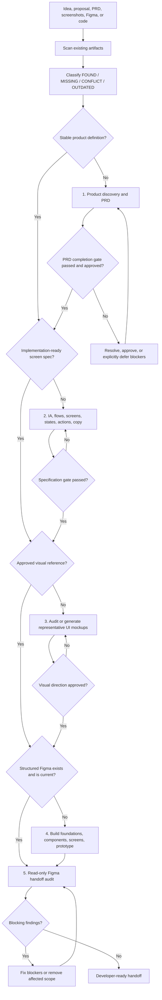

# Walk Into Figma

[한국어](README.ko.md) · English

> **Specifications, not magic.**

Turn a rough idea, proposal, PRD, screenshot, or existing Figma file into validated product requirements, reviewable UI mockups, a structured Figma prototype, and a developer-ready handoff.

**One prompt. Start anywhere.** The pipeline detects what you already have and runs only the stages you need.

This is not a magic skill. That is why it is repeatable. You and AI progressively remove ambiguity, review concrete artifacts, and record approvals so developers do not have to guess.

## What it solves

Product work often breaks between documents:

- a PRD looks complete but still contains unapproved assumptions;
- a UI specification names screens but does not define what buttons do;
- a polished mockup hides missing loading, error, locked, and recovery states;
- a Figma file drifts away from the latest decisions;
- developers receive attractive screens without an implementation contract.

Walk Into Figma treats discovery, specification, visual review, Figma production, and handoff QA as one traceable journey.

## Quick start

Install every skill:

```bash
git clone https://github.com/Dr-Min/walk-into-figma.git
cd walk-into-figma
./scripts/install.sh
```

Restart or reload Codex if the client does not discover new skills immediately. Then ask:

```text
Use $walk-into-figma. Inspect what I already have and take this product
from its current stage to a validated design and developer-ready Figma handoff.
```

You can also start naturally:

```text
I have a rough product proposal. Help me turn it into a PRD and Figma.
```

The main skill allows implicit invocation for relevant digital product design requests. Specialist skills use explicit invocation to avoid overlapping trigger contracts. Use `$walk-into-figma` when you want to force the full pipeline, or call a specialist directly with its `$skill-name`.

## Start with anything

| What you have | What the pipeline does first |
|---|---|
| One-sentence idea | Clarifies the product foundation and begins the PRD |
| Rough proposal or notes | Extracts decisions, assumptions, conflicts, and missing evidence |
| Existing PRD | Audits completeness instead of rewriting it blindly |
| Screen list or UI copy | Reconstructs journeys and missing interaction contracts |
| Screenshots or mockups | Maps visuals to screens/states and identifies coverage gaps |
| Existing Figma file | Inspects structure, interactions, drift, and handoff readiness |
| Frontend code/design system | Reuses existing components and tokens as an authoritative source |
| A mixture of sources | Classifies each source and resolves precedence explicitly |

Every input is classified as `FOUND`, `MISSING`, `CONFLICT`, or `OUTDATED`.

## Full workflow



## How the collaboration works

The default is **staged review mode**. The AI does not run away and invent the entire product in one pass.

At each chapter boundary it presents:

```text
Confirmed
AI recommendation + rationale
Decision required
Conflicts
Files updated
Revise this chapter, or approve it and continue?
```

Related questions are batched. Minor, reversible implementation details may be recommended and recorded without interrupting the user. Decisions that change scope, money, policy, risk, a primary journey, visual direction, or the Figma destination require approval.

In staged mode, each review turn asks for at most three closely related material decisions. The complete blocker register remains visible, but later decisions stay queued instead of being dumped into one oversized questionnaire.

Review, audit, explanation, and status requests run in `REPORT ONLY` mode and do not create, rename, organize, generate, or update files. Artifact and Figma writes require the corresponding authoring request and approved scope.

### Major-stage progress message

After a stage actually passes its exit criteria, the skill explains:

1. which stage was completed;
2. what journey comes next;
3. what completing the next stage improves;
4. what may go wrong if it is skipped;
5. what the user will review next.

It never reports a stage as complete merely because a draft exists.

### Autonomous execution

You can explicitly ask:

```text
Use $walk-into-figma. Ask only about material decisions and complete
all reversible work autonomously.
```

The AI still stops for material ambiguity, conflicting authoritative sources, production destinations, and irreversible external changes.

## The five approval gates

| Gate | Must be true before passing |
|---|---|
| Product | Problem, users, value, rules, policy, and MVP are complete and approved |
| Specification | Every MVP screen, action, state, exception, and destination is mapped |
| Visual | Representative mockups establish an approved visual direction |
| Figma scope | Account, team, file, platforms, pages, and prototype scope are verified |
| Handoff | Every blocker is fixed; major findings are fixed or explicitly accepted with owner and rationale |

## PRD completion is strict

A long PRD is not necessarily a finished PRD.

The PRD skill scores 13 weighted dimensions and checks blocking conditions. Each applicable dimension contributes `weight × score ÷ 2`; approved `N/A` dimensions are removed from numerator and denominator. It may return a diagnostic percentage, but only one state is considered complete:

```text
PRD STATUS: 100% COMPLETE — APPROVAL RECORDED
```

This requires:

- every applicable dimension is covered;
- every material decision is user-confirmed or explicitly deferred outside the release;
- no unresolved contradiction remains;
- requirements and acceptance criteria are testable and traceable;
- the user approves the final completion summary.

Otherwise it returns:

```text
PRD STATUS: NOT COMPLETE
```

and lists `Decision required`, `Approval required`, `Missing evidence`, `Conflict`, and `Deferred` items, followed by the shortest path to completion.

AI recommendations never become user decisions automatically.

A deferral is valid only when the user approves its reason, owner, target release or review date, current-release impact, and temporary behavior.

## Why visual mockups exist

Text specifications define behavior precisely, but they do not let the user and AI inspect hierarchy, density, composition, visual tone, media treatment, or navigation feel together.

When no reviewable UI reference exists, the pipeline uses ImageGen to create a small representative set **after** the screen specification is stable. These images begin as:

```text
[AI DRAFT — VISUAL CONCEPT]
```

After review, selected images become:

```text
[APPROVED VISUAL REFERENCE]
```

Generated images are not production specifications. Exact behavior, components, accessibility, responsiveness, and copy remain governed by the specification and structured Figma file.

## The six skills

| Skill | Responsibility | Can run independently |
|---|---|---|
| `$walk-into-figma` | Detects current state and orchestrates the whole journey | Yes |
| `$product-discovery-prd` | Turns rough input into a decision-complete, approved PRD | Yes |
| `$ui-screen-spec` | Defines IA, flows, screens, actions, states, exceptions, and copy | Yes |
| `$ui-mockup-review` | Audits or generates representative mockups and records approval | Yes |
| `$figma-product-builder` | Builds reusable Figma foundations, components, screens, and prototype | Yes |
| `$figma-handoff-audit` | Performs read-only drift, interaction, coverage, and handoff QA | Yes |

## Tool and MCP behavior

The package does not bundle external services. It calls available capabilities only when the stage needs them:

- **ImageGen** — missing representative UI mockups;
- **Figma MCP and official Figma skills** — Figma inspection, creation, updates, libraries, and prototype work;
- **browser/Present mode** — interaction QA;
- **web research** — current prices, vendor capabilities, technical specifications, or other unstable facts.

Before writing to Figma, the builder verifies the authenticated account, team, destination file, permissions, and approved scope. A mismatch stops the write.

If a required integration is unavailable, the skill reports the missing capability and continues with any independent artifact work that remains possible.

## Artifacts

The default project contract is:

```text
product/
├── project-intake.yaml
├── PRD.md
├── DECISION_LOG.md
├── IA_AND_USER_FLOWS.md
├── SCREEN_AND_INTERACTION_SPEC.md
├── UI_COPY.md
├── design_previews/
├── figma-build-manifest.json
└── FIGMA_QA_REPORT.md
```

Existing project conventions take precedence. Stable IDs connect requirements, decisions, flows, screens, actions, states, components, and QA findings.

The Figma manifest stores the PRD version/hash, Figma file key, built screen and component IDs, prototype flows, pending synchronization, and accepted exceptions. This makes drift visible.

Every MVP action must be classified as either `PROTOTYPED` in Figma or `SPEC ONLY` with an exact linked behavior and reason. An unclassified action prevents handoff readiness. A `BLOCKER` cannot be waived as an accepted exception.

## Source precedence

When sources disagree:

1. current explicit user decision;
2. a newer user-confirmed decision-log entry that supersedes the approved PRD;
3. latest approved PRD;
4. other user-confirmed decision-log entries;
5. existing code or design system;
6. approved visual reference;
7. UI copy deck;
8. competitor or inspiration reference;
9. AI recommendation.

Drafts and recommendations never override approved sources. When a newer confirmed decision supersedes the PRD, the PRD is marked outdated until synchronized and re-approved. Conflicts are reported, never silently resolved.

## Install

The default installation creates symbolic links under `${CODEX_HOME:-~/.codex}/skills`, so changes in the cloned repository are reflected immediately.

```bash
./scripts/install.sh
```

Choose a different destination:

```bash
./scripts/install.sh --dest /path/to/skills
```

Copy instead of linking:

```bash
./scripts/install.sh --copy
```

Existing unrelated skill directories are never deleted. A conflicting destination fails safely unless it already points to this repository.

## Validate

```bash
./scripts/validate-all.sh
```

The script validates all six `SKILL.md` files, checks required metadata and invocation policy, rejects TODO placeholders, checks internal reference links, and verifies the expected skill set.

## Package

```bash
./scripts/package.sh
```

This validates first, creates a versionable archive under `dist/`, then checks that the archive exactly matches the source and contains no unsafe paths, AppleDouble metadata, caches, or stale/missing files.

## Update and uninstall

For a linked installation:

```bash
git pull
./scripts/validate-all.sh
```

To uninstall, remove only the six links or copied directories created by this repository. Inspect each target before deleting it.

## Example prompts

```text
Use $walk-into-figma. I only have this rough proposal. Start by inspecting it,
then guide me chapter by chapter and do not re-ask confirmed decisions.
```

```text
Use $product-discovery-prd to audit this PRD. Do not call it complete unless
all material decisions are approved or explicitly deferred.
```

```text
Use $ui-screen-spec. Map every button, modal, menu, loading state, error,
and destination for the MVP.
```

```text
Use $ui-mockup-review. Audit these screenshots and generate only the missing
representative screens with ImageGen.
```

```text
Use $figma-handoff-audit. Compare this Figma file with the approved PRD
and screen specification without modifying the file.
```

## Troubleshooting

### The skill does not trigger

- invoke it explicitly with `$walk-into-figma`;
- confirm the skill directory is installed under the active Codex skills path;
- reload the client after installation;
- run `./scripts/validate-all.sh`.

### Figma is connected to the wrong account

Do not proceed with writes. Reconnect the intended account, then verify account, team, and file again.

### I have Figma but no PRD

The pipeline can audit the file, reconstruct likely screens, and identify missing product decisions. It will not pretend visual evidence proves business rules.

### I have a PRD but no images

The screen specification is completed first. Then representative visual concepts are generated and reviewed before large-scale Figma construction.

### Why does the process stop?

It stops when a material decision would change scope, cost, risk, policy, primary behavior, visual direction, or the production destination. Resolve or explicitly defer the item to continue.

## Contributing

Keep `SKILL.md` concise and operational. Put detailed contracts in `references/`. Do not add README files inside individual skill folders. Run validation before submitting changes.

## License

Released under the [MIT License](LICENSE). Copyright © 2026 Walk Into Figma contributors.

The MIT License permits use, modification, distribution, sublicensing, and commercial use while requiring the copyright and license notice to remain in copies or substantial portions. The software is provided without warranty.
